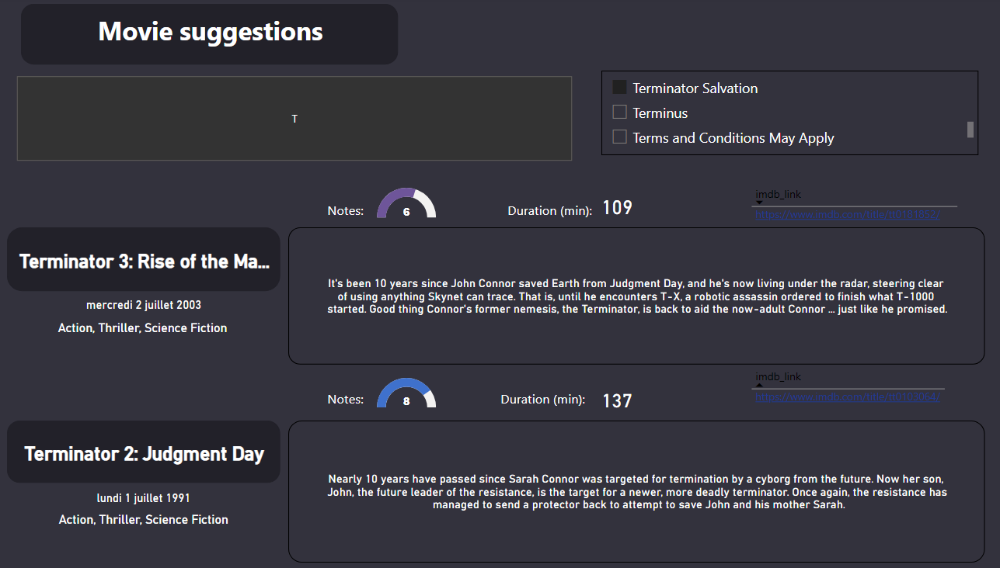

# Movie_recommendation

## The mission

The task is to create a recommendation tool for movies and TV shows that an user can interact with. This tool will take as input the user's favorite movies and recommend new ones in a user friendly manner

## Executions steps

* Explore and clean the data
* Build recommendations with python
* Build the tool (a Power BI dashboard)

### The data

The data used to build this movie recommendation system can be found on [Kaggle](https://www.kaggle.com/datasets/rounakbanik/the-movies-dataset). From these datas I will ony use the '_movies_metadata_' csv.

The file [Data_exploration](./Codes/Data_exploration.ipynb) is dedicated to explore and clean this csv. In this file I deleted some useless columns and some lines that contained NAN's. The final result of this file is the following table:

This table will be saved in a csv (named movies_features.csv). In the dashboard the columns _poster_path_ and _production_companies_ won't be used, the paths of the poster are mostly down and the _production_companies_ column contains a lot of empty values.

### Recommendation system

The recommendation system is done in python and will be based on the column _overview_ which gives a summary of the movie. The steps to create these suggestions are the following:
* Preprocess the data using __nltk__ ( imports: stopwords and word_tokenize)
* Build tthe TF-IDF matrix using __sklearn__ (import: TfidfVectorizer)
* Build the cosine similarity matrix using __sklearn__ (import: cosine_similarity)
* With the cosine similarity matrix we are now able to get the 5 most similar movies for each movies. The last part of this file is so dedicated to add 5 columns to the csv with the ids of thess 5 movies. This new csv will be saved as _movies_with_recommendation.csv_.

You can find those codes in the file [TF_IDF](./Codes/TF_IDF.ipynb)

### Dashboard
 The last part of the project is to build the dashboard. The user will be able to select his favourite movie. At first he chooses the first letter of the movie then the title.
 

When this movie is selected the dasboard will suggest the 2 most similar movies with some featues such as votes' average, duration, summary,...

## Limit of the project
This project could be improved in various ways:
* Recommendations are poor in quality. The overview can be very short for some movies, you can have a movie recommended only because the name of the hero is similar even though the story or type of movie is completely different. To improve the recommendation system we have to use more datas than the _overview_ column only.
* The table has to be imported 3 times in Power BI to be able to link the ids of the movies with their features. Finding a way the link the table with 'itself' could be a great idea to improve performance.
* Importing a csv with suggestions decreases drastically the range of filtering we can apply on the suggestions (the user may want to see suggestions of movies with duration < 120 minutes only). To make these filtering possible we should either find a way to use python efficiently in Power BI or to use a different tool like streamlit (Power BI was not in the requirement). This would also solve the previous problem.
