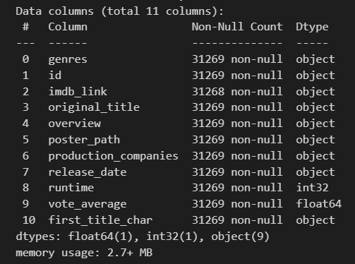

# Movie_recommendation

## The mission

The task is to create a recommendation tool for movies and TV shows that an user can interact with.

The tool will take as input the user's favorite movies and shows and recommend new ones in a user friendly manner. You are allowed to use additional resources and incorporate other features that are interesting for users.

## Executions steps

* Explore and clean the data
* Build recommendations with python
* Build the tool (a Power BI dashboard)

### The data

The data used to build this movie recommendation system can be found on [Kaggle](https://www.kaggle.com/datasets/rounakbanik/the-movies-dataset). From these datas I will ony use the '_movies_metadata_' csv.

The file [Data_exploration](./Codes/Data_exploration.ipynb) is dedicated to explore and clean this csv. In this file I deleted some useless columns and some lines that contained NAN's. The final result of this file is the following table:

